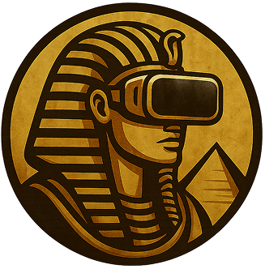
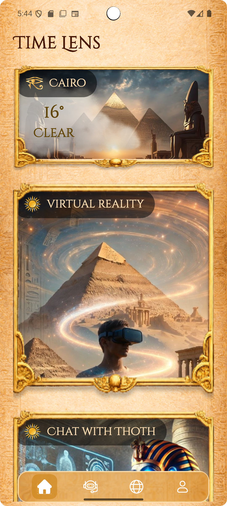
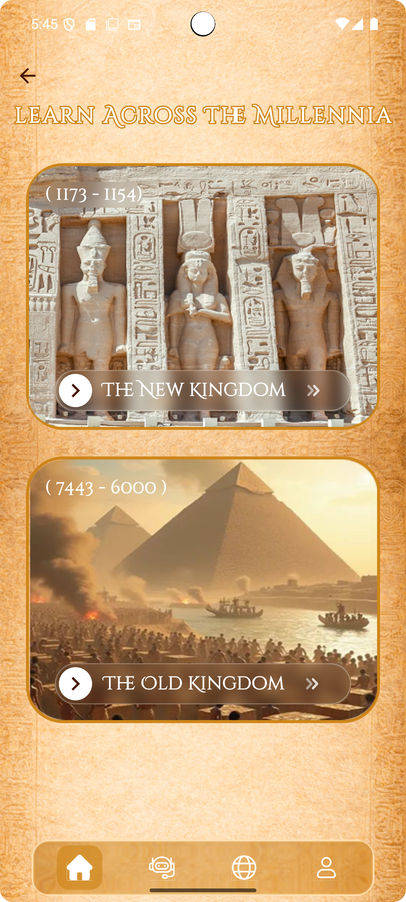
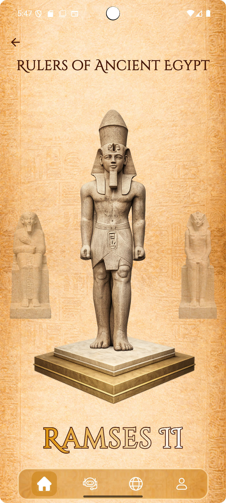
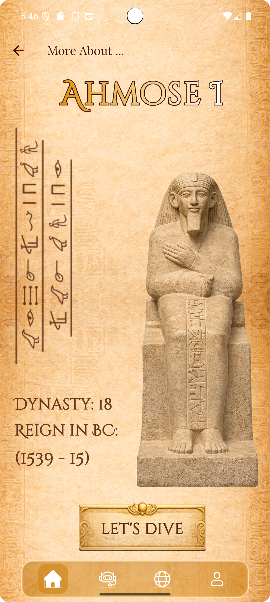
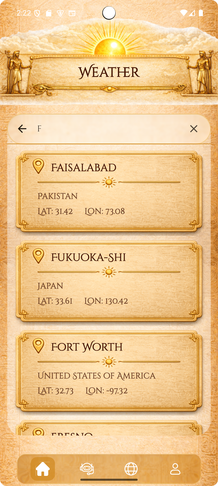
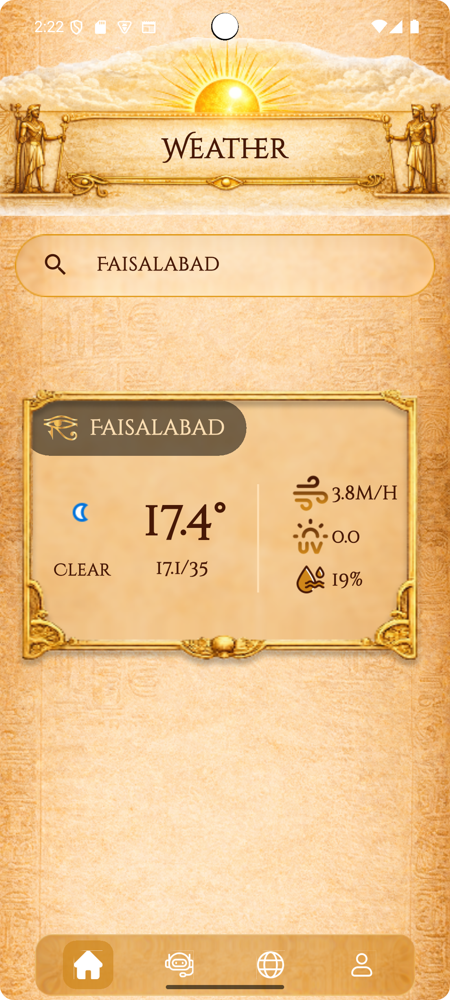
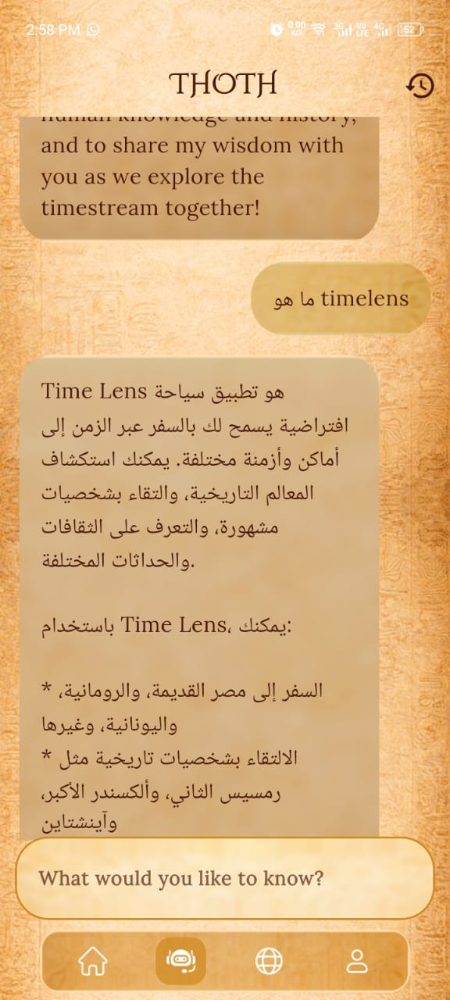

<div align="center">



# 🏺 Time Lens

### *Step through the sands of time. Meet the legends of Ancient Egypt.*

[](https://flutter.dev)
[](https://dart.dev)
[](#architecture)
[](#)

> **Time Lens** is a VR-powered Egypt tourism app that transports you back to Ancient Egypt — where you choose your era, pick a pharaoh or queen, and speak with them face to face.

</div>

---

## 🎬 Demo

> 📸 *Screenshots showcasing the golden UI experience across key app flows.*

<div align="center">
  <video src="https://github.com/user-attachments/assets/29c55766-2c7a-435d-b2df-2df21eb304ac" controls width="80%"></video>
</div>

| Home & Weather | Era Selection | Character Pick | Character Details |
|:-:|:-:|:-:|:-:|
|  |  |  |  |

| Weather Search | Weather Result | Chatbot — Thoth |
|:-:|:-:|:-:|
|  |  |  |

---

## ✨ Features

### 🏠 Home
The home screen is split into two distinct experiences:

- **Weather** — Search any location worldwide and get live weather data, beautifully presented in the golden royal theme.
- **VR Journey** — The gateway to your time travel. Browse eras, pick your ruler, and launch the VR experience with your preferences loaded automatically.

### ⏳ Eras & Characters
- Browse curated historical eras of Ancient Egypt (Old Kingdom, New Kingdom, Late Period, and more).
- Each era surfaces its iconic kings and queens — with rich visual profiles and historical context.
- Select your character and the VR set plays the full immersive experience.

### 🦅 Thoth — AI Chatbot
- Meet **Thoth**, the ancient Egyptian god of wisdom and your in-app guide.
- Ask anything about history, characters, eras, or plan your VR journey — Thoth has the answers.

### 🌐 Profile & Language
- Switch the app language from your profile.
- Personalize your experience and manage your preferences.

---

## 🏛️ Architecture

Time Lens follows **Clean Architecture** principles with a feature-first folder structure, ensuring a clear separation between data, domain, and presentation layers.

```
lib/
├── core/                        # Shared foundation
│   ├── data_sources/            # Remote & local data sources
│   ├── errors/                  # Failure & exception classes
│   ├── helper_functions/        # Global utility helpers
│   ├── network/                 # Dio / HTTP setup
│   ├── services/                # App-level services
│   ├── utils/                   # Constants, extensions, theme
│   └── widgets/                 # Reusable UI components
│
├── features/                    # Feature modules
│   ├── auth/
│   │   ├── data/
│   │   │   ├── models/          # DTOs / JSON serialization
│   │   │   └── repos/           # Data layer repo implementations
│   │   ├── domain/
│   │   │   ├── entities/        # Pure business objects
│   │   │   ├── repos/           # Abstract repo contracts
│   │   │   └── usecases/        # Single-responsibility use cases
│   │   └── presentation/
│   │       ├── cubits/          # BLoC / Cubit state management
│   │       └── views/           # Screens & widgets
│   │
│   ├── home/                    # Weather + VR launch hub
│   ├── eras/                    # Era browsing & selection
│   ├── figures/                 # Pharaohs & queens profiles
│   ├── chatbot/                 # Thoth AI chatbot
│   ├── profile/                 # Language & user preferences
│   ├── onboarding/              # First-run experience
│   ├── splash/                  # Splash screen
│   └── vr_instructions/         # VR headset guidance
│
├── generated/                   # Auto-generated assets (flutter_gen)
├── l10n/                        # Localization / ARB files
├── constants.dart               # App-wide constants
└── main.dart                    # Entry point
```

### Layer Responsibilities

| Layer | Responsibility |
|---|---|
| **Data** | API calls, local storage, model serialization |
| **Domain** | Business logic, entities, use case contracts |
| **Presentation** | UI, Cubits, state management |
| **Core** | Shared infrastructure used across all features |

---

## 🛠️ Tech Stack

| Category | Technology |
|---|---|
| **Framework** | Flutter 3.x |
| **Language** | Dart 3.x |
| **Architecture** | Clean Architecture + Feature-first |
| **State Management** | flutter_bloc / Cubit |
| **Localization** | flutter_localizations + ARB |
| **Networking** | Dio |
| **VR Integration** | Meta Quest 3S VR Set |
| **AI Chatbot** | funnel tuned AI model |
| **Asset Generation** | flutter_gen |

---

## 🚀 Getting Started

### Prerequisites

- Flutter SDK `>=3.0.0`
- Dart SDK `>=3.0.0`
- A connected VR headset (for VR features) or an emulator (for UI)

### Installation

```bash
# 1. Clone the repository
git clone https://github.com/Jik00/timeLens.git

# 2. Navigate to the project
cd timeLens

# 3. Install dependencies
flutter pub get

# 4. Generate assets & localization
flutter gen-l10n
flutter packages pub run build_runner build

# 5. Run the app
flutter run
```

---

## 🎨 Design Language

Time Lens uses a **golden royal theme** inspired by the grandeur of Ancient Egyptian aesthetics:

- 🟡 **Gold & Black** — Dominant palette evoking pharaonic luxury
- 🏺 **Hieroglyphic motifs** — Decorative elements woven through the UI
- ✨ **Rich animations** — Transitions worthy of a royal court
- 🔤 **Regal typography** — Typefaces chosen for authority and elegance

---

## 👤 Author

**Youstina Habib**
- GitHub: [@Jik00](https://github.com/Jik00)
- LinkedIn: [Youstina Habib](https://www.linkedin.com/in/youstina-habib-16349a319)

---

<div align="center">

*Built with 💛 and a deep love for Ancient Egypt*

**⭐ Star this repo if Time Lens took you back in time!**

</div>